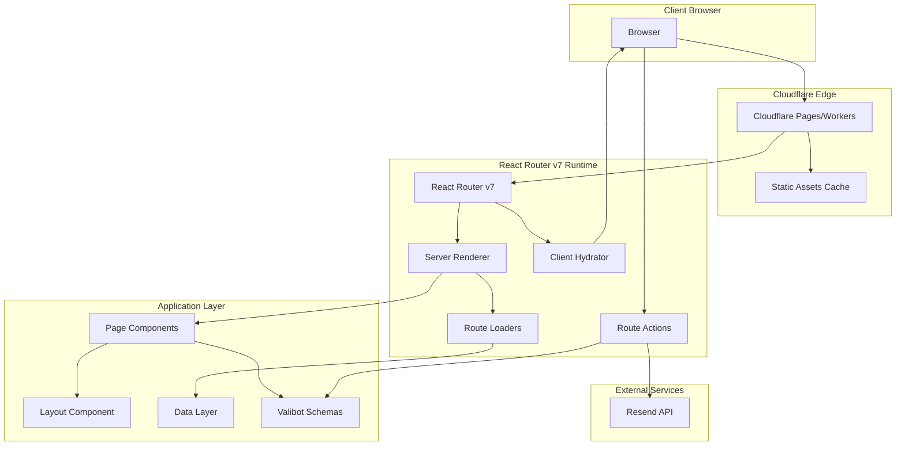
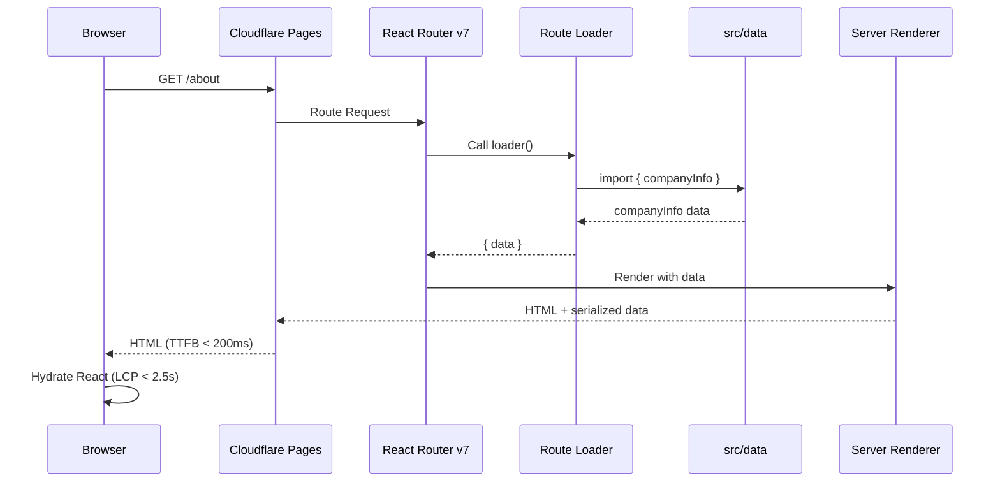
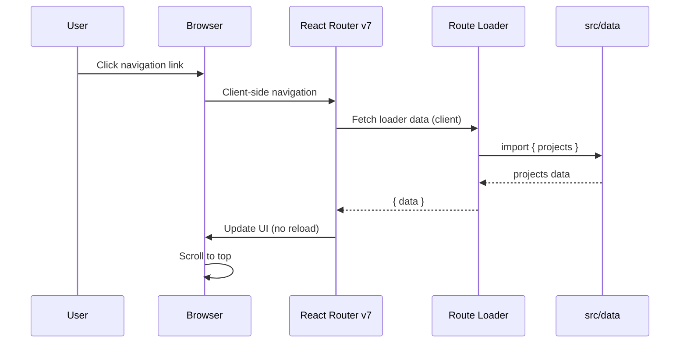
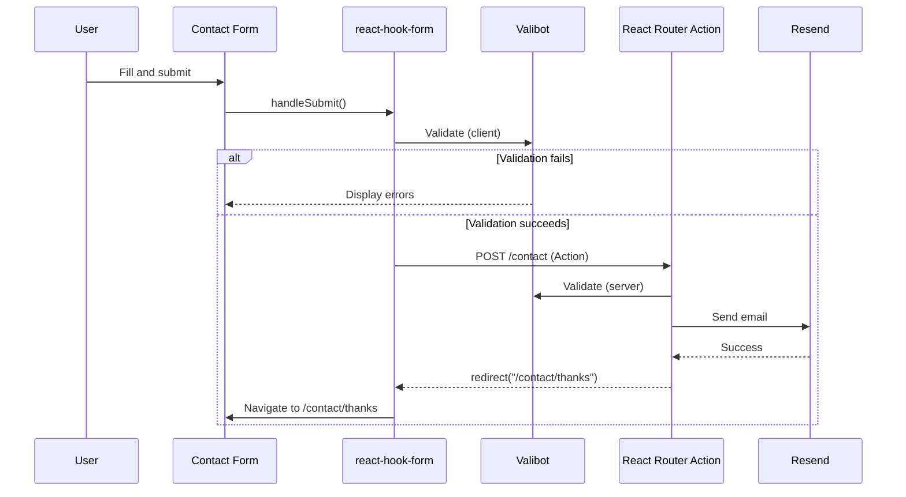
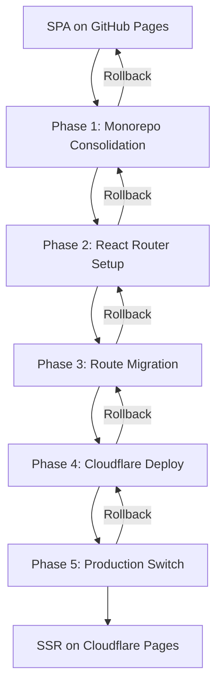

# Technical Design: Web SSR Cloudflare Migration

## Overview

**Purpose**: Web パッケージを SPA から SSR (Server-Side Rendering) に移行し、GitHub Pages から Cloudflare Workers/Pages へデプロイ先を変更する。これにより、SEO 最適化、初期表示速度の向上 (TTFB < 200ms、LCP < 2.5s)、動的コンテンツのサポートを実現する。

**Users**: エンドユーザーは高速な初期表示を体験し、開発者は SSR 対応の開発環境で効率的にコンテンツを管理できる。

**Impact**: 現在の CSR (Client-Side Rendering) アーキテクチャから SSR へ全面移行し、データドリブンコンテンツモデルを維持しつつ、デプロイインフラを Cloudflare に統一する。SSR 化により Contact API をサーバーサイド Action として実装可能になるため、モノレポ構成を 3 パッケージ (web, worker, shared) から単一パッケージに簡素化する。同時に、web/ ディレクトリを廃止してルート直下に移動する。

### Goals
- React Router v7 による SSR フレームワーク統合と React 19 互換性維持
- Cloudflare Workers/Pages への自動デプロイパイプライン構築
- 既存データレイヤー (`src/data/`) とコンポーネントの最大限の再利用
- Tailwind CSS v4 の SSR 対応と FOUC 回避
- パフォーマンス目標: TTFB < 200ms, LCP < 2.5s
- ディレクトリ構造の簡素化 (web/ 廃止)

### Non-Goals
- UI デザインの刷新 (既存コンポーネントを再利用)
- テストフレームワークの導入 (別タスクで実施)
- RSC (React Server Components) の採用 (将来検討)

## Architecture

> 詳細なリサーチノートは `research.md` を参照。設計判断と契約は以下に記載。

### Existing Architecture Analysis

**現在のアーキテクチャ**:
- **CSR (Client-Side Rendering)**: `HashRouter` による完全なクライアントサイドレンダリング
- **データ駆動モデル**: `web/src/data/` にコンテンツを集約し、コンポーネントが直接 import
- **Layout パターン**: すべてのページが `Layout` コンポーネントでラップ
- **Section 積み上げ**: `Section` コンポーネントを使用した構造化
- **モノレポ**: web (SPA), worker (Hono API), shared (Valibot スキーマ)
- **パッケージマネージャー**: pnpm workspace

**統合ポイント**:
- `@homepage/shared`: Valibot スキーマと型定義 (Contact フォーム) → **SSR 移行後はルート直下に統合**
- 環境変数: `VITE_CONTACT_FORM_ENDPOINT` (Worker API URL) → **SSR 移行後は不要 (Action 化)**
- Worker API: `POST /api/contact` (既存の Cloudflare Workers) → **SSR 移行後は React Router Action に置き換え**

**技術的制約**:
- React 19.2, TypeScript strict mode, Biome, tsgo を維持
- pnpm workspace モノレポ構成 → **SSR 移行後は単一パッケージ構成に簡素化**
- web/ ディレクトリ → **ルート直下に移動**

### Architecture Pattern & Boundary Map

**Selected Pattern**: **React Router v7 SSR with Cloudflare Workers**



**Architecture Integration**:
- **選定パターン**: React Router v7 SSR (Remix 後継フレームワーク)
- **Domain Boundaries**:
  - **Routing Layer**: React Router v7 がサーバー・クライアント統一ルーティングを管理
  - **Data Layer**: Route Loader が `src/data/` からデータを取得
  - **Presentation Layer**: 既存の Page/Layout/Section コンポーネントを再利用
  - **Action Layer**: React Router Action でお問い合わせフォーム処理 (Worker API を置き換え)
- **既存パターン維持**:
  - Layout ラップパターン (固定ヘッダー・フッター)
  - Section 積み上げ構成 (背景交互)
  - データドリブンコンテンツモデル
- **新規コンポーネント**:
  - `app/root.tsx`: React Router のルートレイアウト
  - `app/routes/*.tsx`: ファイルベースルーティング (7 ルート)
  - Route Loader 関数: サーバーサイドデータフェッチ
  - Route Action 関数: お問い合わせフォーム送信とメール送信
- **プロジェクト構造簡素化**:
  - worker パッケージを削除 (Contact API を Action 化)
  - shared パッケージを削除 (Valibot スキーマをルート直下に統合)
  - web/ ディレクトリを削除 (ルート直下に移動)
  - pnpm workspace から pnpm 単一パッケージ構成へ移行
- **Steering 準拠**:
  - TypeScript strict mode + Biome
  - データとプレゼンテーションの分離

### Technology Stack

| Layer | Choice / Version | Role in Feature | Notes |
|-------|------------------|-----------------|-------|
| **Frontend Framework** | React 19.2 | UI レンダリング | 既存バージョン継続使用 |
| **SSR Framework** | React Router v7 | サーバーサイドレンダリング + ルーティング | Remix 後継、Cloudflare Workers GA サポート |
| **Build Tool** | Vite (via React Router) | ビルドとバンドル | rolldown-vite から標準 Vite へ移行 |
| **Package Manager** | pnpm | パッケージ管理 | 既存継続使用 (workspace 機能なし) |
| **Styling** | Tailwind CSS v4 + @tailwindcss/vite | スタイリング | 既存設定継続、Vite プラグイン統合 |
| **Form Management** | react-hook-form 7.66 + Valibot 1.1 | お問い合わせフォーム | 既存実装継続使用 |
| **Validation** | Valibot 1.1 | スキーマバリデーション | ルート直下で管理 |
| **Email Service** | Resend 6.4.2 | メール送信 | Action 内から直接呼び出し |
| **Runtime** | Cloudflare Workers (workerd) | サーバーランタイム | 開発・本番環境で一致 |
| **Deployment** | Cloudflare Pages | ホスティングとデプロイ | GitHub Pages から移行 |
| **CI/CD** | GitHub Actions + wrangler | 自動デプロイパイプライン | Cloudflare CLI 使用 |
| **Type Checking** | TypeScript 5.9 + tsgo | 型安全性 | 既存ツール継続 |
| **Linter/Formatter** | Biome 2.3.4 | コード品質 | 既存設定継続 |

**Rationale**: React Router v7 は Cloudflare Workers をネイティブサポートし (GA)、React 19 互換性を保証。Vite 統合により Tailwind CSS v4 を継続使用でき、既存の開発環境を最大限活用可能。詳細な選定理由は `research.md` を参照。

## System Flows

### SSR Request/Response Flow



**Key Decisions**:
- サーバーサイドで Loader が `src/data/` から静的データを import
- データを JSON でシリアライズし、HTML に埋め込み
- クライアントでハイドレーション時にデータを復元
- Static Asset は Cloudflare Pages で CDN キャッシュ

### Client-Side Navigation Flow



**Key Decisions**:
- クライアントサイドナビゲーションはページリロードなし
- Loader はクライアントでも実行され、データを取得
- スクロールトップ動作は React Router の ScrollRestoration で実現

### Contact Form Submission Flow



**Key Decisions**:
- react-hook-form + Valibot を継続使用 (クライアントバリデーション)
- React Router Action でサーバーサイド処理 (Worker API を置き換え)
- Resend API を Action 内から直接呼び出し
- クライアント・サーバー両方で Valibot バリデーション

## Requirements Traceability

| Requirement | Summary | Components | Interfaces | Flows |
|-------------|---------|------------|------------|-------|
| 1.1-1.5 | SSR フレームワーク統合 | React Router v7, Server Entry | Route Loader, root.tsx | SSR Request Flow |
| 2.1-2.5 | Cloudflare デプロイ環境 | Cloudflare Pages, GitHub Actions | wrangler.toml, deploy.yaml | CI/CD Pipeline |
| 3.1-3.5 | ルーティングシステム | React Router, routes/*.tsx | Route definitions | SSR/Client Navigation |
| 4.1-4.5 | データレイヤー互換性 | Route Loaders, web/src/data | Loader functions | Data Hydration |
| 5.1-5.5 | スタイリングシステム | Tailwind CSS v4, @tailwindcss/vite | Vite config | Critical CSS |
| 6.1-6.5 | お問い合わせフォーム | Contact.tsx, react-hook-form | Worker API client | Form Submission |
| 7.1-7.5 | 開発環境互換性 | Vite dev server, HMR | vite.config.ts | Local Development |
| 8.1-8.5 | パフォーマンス要件 | CDN caching, SSR optimization | Cloudflare Pages | Performance Metrics |
| 9.1-9.5 | モノレポ構成維持 | pnpm workspace | package.json | Monorepo Build |
| 10.1-10.5 | 後方互換性 | URL structure preservation | Route mapping | Migration Path |

## Components and Interfaces

### Component Summary

| Component | Domain/Layer | Intent | Req Coverage | Key Dependencies | Contracts |
|-----------|--------------|--------|--------------|--------------------------|-----------|
| **app/root.tsx** | Routing | React Router ルートレイアウト | 1, 3, 5 | React Router v7 (P0), Tailwind (P0) | [x] Service [ ] API [ ] Event [ ] Batch [x] State |
| **app/routes/_index.tsx** | Page | Home ページルート | 3, 4 | Loader (P0), Home component (P0) | [x] Service [ ] API [ ] Event [ ] Batch [ ] State |
| **app/routes/about.tsx** | Page | About ページルート | 3, 4 | Loader (P0), About component (P0) | [x] Service [ ] API [ ] Event [ ] Batch [ ] State |
| **app/routes/contact.tsx** | Page | Contact ページルート + Action | 3, 6 | Loader (P0), Action (P0), Contact component (P0), Resend (P0) | [x] Service [x] API [ ] Event [ ] Batch [ ] State |
| **app/entry.server.tsx** | Infrastructure | サーバーエントリーポイント | 1, 2 | React Router server APIs (P0) | [x] Service [ ] API [ ] Event [ ] Batch [ ] State |
| **app/entry.client.tsx** | Infrastructure | クライアントエントリーポイント | 1 | React Router client APIs (P0) | [x] Service [ ] API [ ] Event [ ] Batch [ ] State |
| **vite.config.ts** | Infrastructure | Vite + Cloudflare 設定 | 2, 5, 7 | @cloudflare/vite-plugin (P0), Tailwind (P0) | [ ] Service [ ] API [ ] Event [ ] Batch [x] State |
| **wrangler.toml** | Infrastructure | Cloudflare Workers 設定 | 2 | Cloudflare runtime (P0), Resend API key binding (P0) | [ ] Service [ ] API [ ] Event [ ] Batch [x] State |
| **Route Loaders** | Data Layer | サーバーサイドデータフェッチ | 4 | web/src/data (P0) | [x] Service [ ] API [ ] Event [ ] Batch [ ] State |
| **Contact Action** | Action Layer | お問い合わせフォーム処理 | 6 | Valibot (P0), Resend (P0) | [x] Service [x] API [ ] Event [ ] Batch [ ] State |

### Routing Layer

#### app/root.tsx

| Field | Detail |
|-------|--------|
| Intent | React Router v7 のルートレイアウトコンポーネント、全ページ共通の HTML 構造とスタイル適用 |
| Requirements | 1.2, 1.3, 3.5, 5.2, 5.3 |

**Responsibilities & Constraints**:
- HTML ドキュメント構造 (`<html>`, `<head>`, `<body>`) の定義
- Tailwind CSS の `<Links>` による CSS 注入 (Critical CSS)
- `<Outlet>` によるページコンポーネントのレンダリング
- `<ScrollRestoration>` によるスクロール位置管理
- ハイドレーション用の `<Scripts>` 注入

**Dependencies**:
- Inbound: React Router v7 — ルート定義と Outlet (P0)
- Outbound: Tailwind CSS — スタイルシート (P0)
- External: Cloudflare Workers runtime — SSR 実行環境 (P0)

**Contracts**: [x] Service [ ] API [ ] Event [ ] Batch [x] State

##### Service Interface

```typescript
import type { LinksFunction, MetaFunction } from "react-router";

// Links function: Critical CSS と Tailwind stylesheet を注入
export const links: LinksFunction = () => [
  { rel: "stylesheet", href: "/app/tailwind.css" },
];

// Meta function: SEO タグ定義
export const meta: MetaFunction = () => [
  { title: "株式会社テックリード" },
  { name: "description", content: "企業情報とサービス紹介" },
];

// Layout component
export default function Root() {
  return (
    <html lang="ja">
      <head>
        <Links />
        <Meta />
      </head>
      <body>
        <Outlet />
        <ScrollRestoration />
        <Scripts />
      </body>
    </html>
  );
}
```

**Preconditions**: React Router v7 がセットアップ済み
**Postconditions**: 全ページで一貫した HTML 構造とスタイル適用
**Invariants**: `<Outlet>` が必ず存在し、ページコンポーネントをレンダリング

##### State Management

**State Model**: グローバル HTML 構造 (ステートレス)
**Persistence**: なし (各リクエストで再生成)
**Concurrency**: サーバーサイドは並行リクエストに対応、クライアントはシングルスレッド

**Implementation Notes**:
- **Integration**: Tailwind CSS v4 の Vite プラグインと連携
- **Validation**: TypeScript strict mode で型チェック
- **Risks**: Critical CSS 生成が失敗すると FOUC が発生 (Tailwind プラグイン依存)

#### Route Definitions (app/routes/*.tsx)

| Field | Detail |
|-------|--------|
| Intent | ファイルベースルーティングによる 7 ページの定義と Loader 関数による SSR |
| Requirements | 3.1, 3.2, 3.3, 4.1, 4.2 |

**Responsibilities & Constraints**:
- 各ルートに対応するページコンポーネントのエクスポート
- Loader 関数によるサーバーサイドデータフェッチ
- 既存の Page コンポーネント (`web/src/pages/`) を再利用

**Route Mapping**:
| Route File | URL Path | Existing Component | Loader Data |
|------------|----------|-------------------|-------------|
| `_index.tsx` | `/` | `pages/Home.tsx` | `data/company`, `data/projects` など |
| `about.tsx` | `/about` | `pages/About.tsx` | `data/company`, `data/philosophy` |
| `introduction.tsx` | `/introduction` | `pages/Introduction.tsx` | `data/company` |
| `contact.tsx` | `/contact` | `pages/Contact.tsx` | なし (フォームのみ) |
| `contact.thanks.tsx` | `/contact/thanks` | `pages/ContactThanks.tsx` | なし |
| `news._index.tsx` | `/news` | `pages/News.tsx` | `data/news` |
| `news.$id.tsx` | `/news/:id` | `pages/NewsDetail.tsx` | `data/news` (ID でフィルタ) |

**Dependencies**:
- Inbound: React Router — ルーティングとデータローディング (P0)
- Outbound: `src/data/` — 静的データ (P0)
- Outbound: `src/pages/` — ページコンポーネント (P0)

**Contracts**: [x] Service [ ] API [ ] Event [ ] Batch [ ] State

##### Service Interface

```typescript
import type { LoaderFunction } from "react-router";
import { json } from "react-router";
import Home from "../pages/Home"; // 既存コンポーネント
import { companyInfo } from "../data/company";
import { projects } from "../data/projects";
// ... 他のデータ import

// Loader: サーバーサイドでデータを取得
export const loader: LoaderFunction = async () => {
  return json({
    companyInfo,
    projects,
    // ... 他のデータ
  });
};

// Component: 既存の Home コンポーネントを再利用
export default function Index() {
  const data = useLoaderData<typeof loader>();
  return <Home {...data} />;
}
```

**Preconditions**: `src/data/` と `src/pages/` が存在
**Postconditions**: サーバーでデータを取得し、HTML にシリアライズ、クライアントでハイドレーション
**Invariants**: Loader は常にシリアライズ可能なデータを返す (JSON 互換)

**Implementation Notes**:
- **Integration**: 既存の Page コンポーネントは props でデータを受け取るように改修
- **Validation**: TypeScript strict mode で Loader の返り値を型チェック
- **Risks**: データ構造変更時に型定義が不一致になるリスク (型エクスポートで緩和)

### Infrastructure Layer

#### app/entry.server.tsx

| Field | Detail |
|-------|--------|
| Intent | サーバーサイドエントリーポイント、SSR 実行と HTML 生成 |
| Requirements | 1.2, 2.5 |

**Responsibilities & Constraints**:
- React Router の `renderToString` によるサーバーレンダリング
- HTTP レスポンスヘッダーの設定 (Cache-Control など)
- エラーハンドリングと 500 エラーページのレンダリング

**Dependencies**:
- Inbound: Cloudflare Workers — リクエストハンドリング (P0)
- Outbound: React Router server APIs — SSR 実行 (P0)

**Contracts**: [x] Service [ ] API [ ] Event [ ] Batch [ ] State

##### Service Interface

```typescript
import { renderToString } from "react-dom/server";
import { ServerRouter } from "react-router";
import type { EntryContext } from "react-router";

export default function handleRequest(
  request: Request,
  responseStatusCode: number,
  responseHeaders: Headers,
  remixContext: EntryContext
) {
  const html = renderToString(
    <ServerRouter context={remixContext} url={request.url} />
  );

  responseHeaders.set("Content-Type", "text/html");
  responseHeaders.set("Cache-Control", "public, max-age=3600");

  return new Response("<!DOCTYPE html>" + html, {
    status: responseStatusCode,
    headers: responseHeaders,
  });
}
```

**Preconditions**: Cloudflare Workers ランタイムで実行
**Postconditions**: HTML レスポンスを返し、TTFB < 200ms を達成
**Invariants**: 常に HTML を返す (エラー時も 500 ページ)

**Implementation Notes**:
- **Integration**: Cloudflare Workers の Request/Response API を使用
- **Validation**: TypeScript strict mode で型安全性を保証
- **Risks**: SSR 実行時のエラーでリクエストが失敗 (エラーバウンダリで緩和)

#### vite.config.ts

| Field | Detail |
|-------|--------|
| Intent | Vite ビルド設定と Cloudflare Workers プラグイン統合 |
| Requirements | 2.5, 5.1, 7.1 |

**Responsibilities & Constraints**:
- React Router v7 Vite プラグインの設定
- Tailwind CSS v4 Vite プラグインの設定
- Cloudflare Vite プラグインによる Workers ランタイム統合
- モノレポパス解決 (workspace:* 依存)

**Dependencies**:
- Inbound: Vite — ビルドシステム (P0)
- Outbound: @cloudflare/vite-plugin — Cloudflare 統合 (P0)
- Outbound: @tailwindcss/vite — Tailwind CSS 統合 (P0)

**Contracts**: [ ] Service [ ] API [ ] Event [ ] Batch [x] State

##### State Management

```typescript
import { defineConfig } from "vite";
import { cloudflare } from "@cloudflare/vite-plugin";
import tailwindcss from "@tailwindcss/vite";
import { reactRouter } from "@react-router/dev/vite";

export default defineConfig({
  plugins: [
    cloudflare(),
    tailwindcss(),
    reactRouter(),
  ],
});
```

**State Model**: ビルド設定 (静的)
**Persistence**: vite.config.ts ファイル
**Concurrency**: ビルド時はシングルスレッド

**Implementation Notes**:
- **Integration**: 単一パッケージ構成のため resolve.alias 不要
- **Validation**: Vite のビルドエラーで検証
- **Risks**: Cloudflare プラグインと他プラグインの競合 (公式サンプル参照で緩和)

#### wrangler.toml

| Field | Detail |
|-------|--------|
| Intent | Cloudflare Workers の設定ファイル、環境変数とデプロイ設定 |
| Requirements | 2.1, 2.4 |

**Responsibilities & Constraints**:
- Workers 名、アカウント ID、互換性フラグの定義
- Cloudflare Secrets のバインディング (RESEND_API_KEY, TO_EMAIL)
- Pages プロジェクト名とビルドコマンドの指定

**Dependencies**:
- Inbound: wrangler CLI — デプロイツール (P0)
- External: Cloudflare API — デプロイ先 (P0)

**Contracts**: [ ] Service [ ] API [ ] Event [ ] Batch [x] State

##### State Management

```toml
name = "homepage-web"
compatibility_date = "2025-11-15"

[env.production]
pages_build_output_dir = "./dist/client"

# Cloudflare Secrets の設定方法:
# 1. wrangler CLI で設定 (推奨):
#    wrangler secret put RESEND_API_KEY
#    wrangler secret put TO_EMAIL
#
# 2. または Cloudflare Dashboard で設定:
#    Settings > Environment Variables > Add variable (type: Secret)
#
# 注: Secrets は wrangler.toml に記述せず、CLI または Dashboard で設定する
# 環境変数は Action の context.cloudflare.env から取得可能
```

**State Model**: デプロイ設定 (静的)
**Persistence**: wrangler.toml ファイル
**Concurrency**: デプロイは逐次実行

**Implementation Notes**:
- **Integration**: GitHub Actions で wrangler deploy コマンドを実行
- **Validation**: wrangler CLI でバリデーション
- **Risks**: 環境変数の誤設定 (Cloudflare Dashboard で確認)

### Data Layer

#### Route Loaders

| Field | Detail |
|-------|--------|
| Intent | サーバーサイドでデータを取得し、ページコンポーネントに渡す |
| Requirements | 4.1, 4.2, 4.5 |

**Responsibilities & Constraints**:
- `src/data/` から静的データを import
- JSON でシリアライズ可能なデータのみ返す
- TypeScript strict mode で型安全性を保証

**Dependencies**:
- Inbound: React Router — Loader 実行 (P0)
- Outbound: `src/data/` — データファイル (P0)
- Outbound: `src/types/` — 型定義 (P0)

**Contracts**: [x] Service [ ] API [ ] Event [ ] Batch [ ] State

##### Service Interface

```typescript
import type { LoaderFunction } from "react-router";
import { json } from "react-router";
import type { CompanyInfo, Project } from "../types";
import { companyInfo } from "../data/company";
import { projects } from "../data/projects";

export const loader: LoaderFunction = async () => {
  const data: {
    companyInfo: CompanyInfo;
    projects: Project[];
  } = {
    companyInfo,
    projects,
  };

  return json(data);
};
```

**Preconditions**: `src/data/` と `src/types/` が存在
**Postconditions**: シリアライズされたデータを返す
**Invariants**: データは常に JSON 互換 (Date, Function は除外)

**Implementation Notes**:
- **Integration**: 既存のデータファイルを変更せず、Loader でラップ
- **Validation**: TypeScript strict mode で型チェック
- **Risks**: データ構造変更時の型定義更新漏れ (型エクスポートで緩和)

### Action Layer

#### Contact Action (app/routes/contact.tsx)

| Field | Detail |
|-------|--------|
| Intent | お問い合わせフォームのサーバーサイド処理とメール送信 |
| Requirements | 6.1, 6.2, 6.3, 6.4 |

**Responsibilities & Constraints**:
- POST リクエストからフォームデータを取得
- Valibot スキーマでサーバーサイドバリデーション
- Resend API を使用してメール送信
- 成功時は `/contact/thanks` へリダイレクト
- エラー時はフィールドエラーを返す

**Dependencies**:
- Inbound: React Router — Action 実行 (P0)
- Outbound: Valibot — バリデーション (P0)
- Outbound: Resend — メール送信 (P0)
- External: Cloudflare Secrets — RESEND_API_KEY, TO_EMAIL (P0)

**Contracts**: [x] Service [x] API [ ] Event [ ] Batch [ ] State

##### Service Interface

```typescript
import type { ActionFunction } from "react-router";
import { redirect } from "react-router";
import * as v from "valibot";
import { Resend } from "resend";

// Cloudflare環境変数の型定義
interface CloudflareEnv {
  RESEND_API_KEY: string;
  TO_EMAIL: string;
}

// React Router v7 の context 型定義
interface AppLoadContext {
  cloudflare: {
    env: CloudflareEnv;
  };
}

// Valibot スキーマ (shared から移動)
const contactSchema = v.object({
  name: v.pipe(v.string(), v.minLength(1, "お名前を入力してください")),
  email: v.pipe(
    v.string(),
    v.minLength(1, "メールアドレスを入力してください"),
    v.email("有効なメールアドレスを入力してください")
  ),
  company: v.optional(v.string()),
  subject: v.pipe(v.string(), v.minLength(1, "件名を入力してください")),
  message: v.pipe(v.string(), v.minLength(10, "お問い合わせ内容は10文字以上入力してください")),
});

type ContactFormData = v.InferOutput<typeof contactSchema>;

export const action: ActionFunction = async ({ request, context }) => {
  const formData = await request.formData();
  const data = Object.fromEntries(formData);

  // Valibot バリデーション
  const result = v.safeParse(contactSchema, data);
  if (!result.success) {
    const errors: Record<string, string> = {};
    for (const issue of result.issues) {
      if (issue.path) {
        errors[issue.path[0].key as string] = issue.message;
      }
    }
    return { errors };
  }

  // Cloudflare環境変数へのアクセス
  const { cloudflare } = context as AppLoadContext;
  const resend = new Resend(cloudflare.env.RESEND_API_KEY);

  try {
    await resend.emails.send({
      from: "noreply@example.com",
      to: cloudflare.env.TO_EMAIL,
      subject: `お問い合わせ: ${result.output.subject}`,
      html: `
        <h2>お問い合わせ内容</h2>
        <p><strong>お名前:</strong> ${result.output.name}</p>
        <p><strong>メールアドレス:</strong> ${result.output.email}</p>
        ${result.output.company ? `<p><strong>会社名:</strong> ${result.output.company}</p>` : ""}
        <p><strong>件名:</strong> ${result.output.subject}</p>
        <p><strong>お問い合わせ内容:</strong></p>
        <p>${result.output.message}</p>
      `,
    });

    return redirect("/contact/thanks");
  } catch (error) {
    console.error("Failed to send email:", error);
    return {
      error: "メール送信に失敗しました。しばらく経ってから再度お試しください。",
    };
  }
};
```

**Preconditions**: Cloudflare Secrets に RESEND_API_KEY と TO_EMAIL が設定済み
**Postconditions**: メール送信成功時は `/contact/thanks` へリダイレクト、失敗時はエラーメッセージ返却
**Invariants**: バリデーションエラーまたはメール送信エラーを適切にハンドリング

##### API Contract

**Input**:
- FormData: `{ name, email, company?, subject, message }`

**Output (Success)**:
- `redirect("/contact/thanks")` (302 リダイレクト)

**Output (Validation Error)**:
```typescript
{
  errors: {
    [field: string]: string;
  }
}
```

**Output (System Error)**:
```typescript
{
  error: string;
}
```

**Implementation Notes**:
- **Integration**: react-hook-form からの POST リクエストを処理
- **Validation**: Valibot スキーマでクライアント・サーバー両方でバリデーション
- **Risks**: Resend API の障害時にメール送信失敗 (リトライ機構なし)

## Data Models

### Domain Model

**Aggregates**: 既存のデータ構造を維持 (変更なし)

- `CompanyInfo`: 企業情報 (会社名、CEO、所在地など)
- `Project`: プロジェクト実績 (タイトル、説明、カテゴリ、技術スタック)
- `Service`: 提供サービス (タイトル、説明、機能リスト)
- `TechStack`: 技術スタック (カテゴリ、技術名、習熟度)
- `NewsArticle`: ニュース記事 (タイトル、日付、カテゴリ、本文)

**Business Rules**:
- データは静的で、サーバーサイドで読み込み専用
- クライアントサイドではハイドレーション時にデータを復元

### Logical Data Model

**Structure Definition**: 既存の `src/types/index.ts` を維持

```typescript
export interface CompanyInfo {
  name: string;
  ceo: string;
  founded: string;
  businesses: string[];
  address: {
    postalCode: string;
    prefecture: string;
    city: string;
    street: string;
    building: string;
  };
}

export interface Project {
  id: string;
  title: string;
  description: string;
  category: string[];
  technologies: string[];
  period?: string;
}

// ... 他の型定義
```

**Consistency & Integrity**:
- データファイル (`src/data/`) と型定義 (`src/types/`) の一貫性を TypeScript でチェック
- SSR 時に Loader がデータを取得し、クライアントでハイドレーション

### Data Contracts & Integration

**Loader Data Transfer**:
- Loader 関数が JSON でデータをシリアライズ
- クライアントで `useLoaderData()` でデータを取得
- 型定義により型安全性を保証

```typescript
// Server (Loader)
export const loader: LoaderFunction = async () => {
  return json({ companyInfo, projects });
};

// Client (Component)
export default function Page() {
  const { companyInfo, projects } = useLoaderData<typeof loader>();
  return <div>{companyInfo.name}</div>;
}
```

**Contact Form Integration**:
- Contact フォームは React Router Action でサーバーサイド処理
- Valibot スキーマを web パッケージ内で管理 (shared パッケージから移動)
- クライアント・サーバー両方で同一スキーマでバリデーション
- Resend API を Action 内から直接呼び出し

## Error Handling

### Error Strategy

**Error Categories and Responses**:

**User Errors (4xx)**:
- **404 Not Found**: 存在しないルートへのアクセス → `app/routes/$.tsx` (Catch-All Route) で 404 ページをレンダリング
- **400 Bad Request**: フォームバリデーションエラー → フィールドレベルのエラーメッセージを表示

**System Errors (5xx)**:
- **500 Internal Server Error**: SSR 実行時のエラー → React Router の ErrorBoundary でエラーページをレンダリング
- **503 Service Unavailable**: Worker API の障害 → フォーム送信エラーとして処理

**Business Logic Errors (422)**:
- **Validation Error**: Valibot バリデーションエラー → フィールドごとのエラーメッセージ

### Error Boundary Implementation

```typescript
// app/root.tsx
export function ErrorBoundary() {
  const error = useRouteError();

  if (isRouteErrorResponse(error)) {
    return (
      <html lang="ja">
        <head>
          <title>エラー {error.status}</title>
        </head>
        <body>
          <h1>{error.status} {error.statusText}</h1>
          <p>{error.data}</p>
        </body>
      </html>
    );
  }

  return (
    <html lang="ja">
      <head>
        <title>エラーが発生しました</title>
      </head>
      <body>
        <h1>予期しないエラーが発生しました</h1>
        <p>しばらく経ってから再度お試しください。</p>
      </body>
    </html>
  );
}
```

### Monitoring

- **Error Tracking**: Cloudflare Workers の Tail Logs でエラーを記録
- **Logging**: console.error でエラーをログ出力
- **Health Monitoring**: Cloudflare Analytics でリクエスト成功率を監視

## Testing Strategy

### Unit Tests
- Route Loader 関数のデータ取得ロジック
- Valibot スキーマバリデーション
- ユーティリティ関数の動作確認

### Integration Tests
- サーバーサイドレンダリングの動作確認
- Loader → Component データフローのテスト
- Contact フォーム送信と Worker API 統合

### E2E Tests
- 全 7 ルートのページ表示確認
- クライアントサイドナビゲーションの動作
- Contact フォーム送信フロー

### Performance Tests
- TTFB < 200ms の達成確認
- LCP < 2.5s の達成確認
- Cloudflare Pages CDN キャッシュの効果測定

**Note**: テストフレームワークは未導入のため、別タスクで実装。

## Migration Strategy

### Phase Breakdown



**Phase 1: プロジェクト構造簡素化** (1-2 days)
- shared パッケージの Valibot スキーマをルート直下に移動
- worker パッケージの Contact API ロジックを確認・保存
- web/ ディレクトリをルート直下に移動 (src/, app/, public/ など)
- pnpm-workspace.yaml を削除
- package.json の更新 (Resend 追加)
- GitHub Actions ワークフローの更新 (worker デプロイ削除)
- **ステアリングファイルの更新** (プロジェクトメモリの同期):
  - `.kiro/steering/structure.md`: モノレポ構成をルート直下の単一パッケージ構成に更新
  - `.kiro/steering/tech.md`: 3パッケージから単一パッケージへの変更を反映
  - `.kiro/steering/product.md`: フルスタック型構成から SSR 単一パッケージ構成への変更を反映

**Phase 2: React Router v7 セットアップ** (1-2 days)
- React Router v7 のインストールと設定
- `app/root.tsx` の作成
- Vite config の更新 (Cloudflare プラグイン追加)
- ローカル開発環境での動作確認

**Phase 3: ルート移行** (3-5 days)
- 7 ルートのファイルベースルーティング実装
- Loader 関数の実装とデータ取得
- Contact Action の実装 (Resend 統合)
- 既存ページコンポーネントの統合
- スクロールトップ動作の確認
- **既存 SPA コードの削除**:
  - `src/App.tsx` の `HashRouter` を削除 (React Router v7 は app/root.tsx で管理)
  - `vite.config.ts` の GitHub Pages base path 設定 (`base: "/homepage/"`) を削除
  - `src/main.tsx` を SSR エントリーポイント (`app/entry.client.tsx`) に置き換え
  - 不要な react-router-dom v6 依存を削除

**Phase 4: Cloudflare デプロイ設定** (2-3 days)
- wrangler.toml の作成
- Cloudflare Secrets の設定 (RESEND_API_KEY, TO_EMAIL)
- GitHub Actions ワークフローの更新
- Staging 環境でのデプロイ確認
- パフォーマンステスト (TTFB, LCP)

**Phase 5: Production 切り替え** (1 day)
- DNS 設定の更新 (GitHub Pages → Cloudflare Pages)
- 本番環境でのデプロイ
- モニタリングとエラー監視

**Rollback Triggers**:
- TTFB > 500ms または LCP > 5s
- 404 エラー率 > 5%
- クリティカルなバグ発生

**Validation Checkpoints**:
- Phase 1: ディレクトリ構造変更後にビルドエラーがないことを確認
- Phase 2: ローカル開発サーバーで全ルート表示確認
- Phase 3:
  - Loader データが正しくハイドレーション
  - Contact フォーム送信テスト
  - **SPA コード削除後のビルドエラーがないことを確認**
  - SSR と CSR の両方で全ルートが正常に動作することを確認
- Phase 4: Staging で全機能動作確認、メール送信テスト
- Phase 5: Production で 24 時間モニタリング
