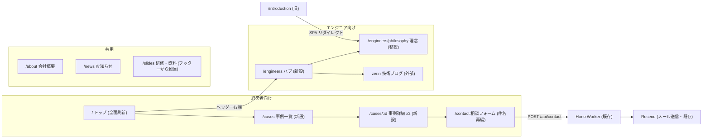

<!-- generated-from: docs/DESIGN_NOTES.md -->

# ホームページ刷新 (DX特化) 概要設計 (DESIGN.md)

生成日: 2026-07-19
ステータス: レビュー待ち (監査反映済み)
種別: 設計書 (概要設計)
対象: techlead-it.com ホームページの情報設計刷新
ジェネレーター: workflow-design-notes (決定台帳 docs/DESIGN_NOTES.md からの再生成物。直接編集しない)
詳細設計: [アプリ詳細 → DESIGN_DETAIL_APP.md](./DESIGN_DETAIL_APP.md) / [インフラ詳細 → DESIGN_DETAIL_INFRA.md](./DESIGN_DETAIL_INFRA.md) (本刷新はインフラ変更が無いため N/A のみ)

## 目次

- [1. 共通](#1-共通)
  - [システム概要](#システム概要)
  - [決定一覧](#決定一覧)
  - [機能要件](#機能要件)
  - [ゴール](#ゴール)
  - [全体構成図](#全体構成図)
  - [技術スタック](#技術スタック)
  - [検討した代替案](#検討した代替案)
  - [制約と前提](#制約と前提)
  - [未解決の論点 (Open Issues)](#未解決の論点-open-issues)
- [2. アプリケーション概要](#2-アプリケーション概要)
- [3. インフラ概要](#3-インフラ概要)

## 1. 共通

### システム概要

株式会社テックリードのホームページを「非IT中小企業の経営者向けの現場DX支援」の顔に全面刷新する。

- 解決する問題: 現ホームページは IT 企業向け高難度受託の顔 (Rust/Go/IoT) で、営業資料 (`public/slides/company/dx.html`) の顔 (中小企業の現場DX) と乖離している。紹介・営業接触後に経営者が社名検索したとき、別人格のサイトが出て商談の温度を下げている
- ホームページの役割: **紹介・営業後の検証装置** (紹介された経営者が社名検索して見て安心する)。直接リード獲得 (Web 集客) は主目的にしない
- 対象ユーザー: 主 = 非IT中小企業の経営者 (ホテル・食品・運送など、社員 10〜100 名規模)。副 = 採用候補のエンジニア (`/engineers` 配下に分離)
- KPI: 30分無料相談の予約数 (月 1〜2 件で成功)。計測は受信メールの件名区分「30分無料相談」を月次で目視集計する (追加実装なし)。流入総数は KPI にしない

### 決定一覧

| 決定                                                                                                   | 理由 (1 文)                                                                                      | 詳細の参照先                                                                                          |
| ------------------------------------------------------------------------------------------------------ | ------------------------------------------------------------------------------------------------ | ----------------------------------------------------------------------------------------------------- |
| トップ訴求は課題語彙 (紙・Excel・属人運用) + 業種不問明記                                              | 「DX」の抽象連呼は補助金業者と識別不能、業種絞りは紹介訪問者を弾く                               | [DETAIL: ページ別セクション構成「トップ」](./DESIGN_DETAIL_APP.md#ページ別セクション構成-ワイヤー)    |
| キーメッセージは dx.html の「作って終わりにしない。現場に根付くDXを、一緒に。」と一致                  | 営業で検証済みのメッセージを Web 化する                                                          | [DETAIL: ページ別セクション構成「トップ」](./DESIGN_DETAIL_APP.md#ページ別セクション構成-ワイヤー)    |
| 事例 3 件を匿名 (業種+規模感表記) で個別ページ化                                                       | 実名許諾が取れないため、実数値と before/after 図解で信用を補強する                               | [DETAIL: ページ別セクション構成「事例」](./DESIGN_DETAIL_APP.md#ページ別セクション構成-ワイヤー)      |
| 事例の視覚素材は before/after 業務フロー図解のみ                                                       | 匿名性維持と許諾不要を両立する                                                                   | [DETAIL: データ設計](./DESIGN_DETAIL_APP.md#データ設計)                                               |
| 料金目安 (幅) をトップのセクションに掲載                                                               | 相場不安が最大の離脱要因で、身元調査は 1 ページ完結が望ましい                                    | [DETAIL: ページ別セクション構成「トップ」](./DESIGN_DETAIL_APP.md#ページ別セクション構成-ワイヤー)    |
| 主 CTA は「30分無料相談・準備不要」。既存 subject 選択肢の先頭に「30分無料相談」を追加し初期選択にする | 要件を文章で書ける経営者はいない、かつスキーマ・メールテンプレート変更ゼロで相談区分を実現できる | [DETAIL: 問い合わせフォーム変更](./DESIGN_DETAIL_APP.md#問い合わせフォーム変更)                       |
| エンジニア向けコンテンツは `/engineers` 配下へ集約 (ハブ + 理念サブページ)                             | 採用の受け皿として温存しつつ、経営者の第一印象を最優先する                                       | [DETAIL: ページ別セクション構成「engineers」](./DESIGN_DETAIL_APP.md#ページ別セクション構成-ワイヤー) |
| `/introduction` は `/engineers/philosophy` へリダイレクト                                              | 既存リンク・被リンクの断絶防止                                                                   | [DETAIL: ルーティング変更](./DESIGN_DETAIL_APP.md#ルーティング変更)                                   |
| 旧トップの既存セクションは改修 3・移設 3・削除 1・CTA 改修 1 に振り分ける                              | 既存コンポーネントの生死を実装者の自己判断にしない                                               | [DETAIL: 既存コンポーネントの行き先](./DESIGN_DETAIL_APP.md#既存コンポーネントの行き先)               |
| 事例記事の SEO は長期の副産物と位置付ける                                                              | 予算ゼロのロングテール SEO は 6〜12 ヶ月で月数百 UV が現実的期待値のため集客装置と期待しない     | — (方針のみ)                                                                                          |

### 機能要件

#### 必須機能 (MUST have)

- トップ (`/`) の経営者向け全面刷新: 課題特化コピー・業種不問明記・悩み提示・支援内容・事例サマリ・支援の進め方・料金目安・会社の強み・相談 CTA
- 匿名事例ページ: `/cases` (一覧) + `/cases/:id` (詳細 3 件)。「課題 → 現場がどう変わったか」の物語 + 実数値 + before/after 図解
- 相談導線: `/contact` の件名選択肢の先頭に「30分無料相談」を追加して初期選択にする (既存フォーム・メール送信フローを維持)
- エンジニア向けページ: `/engineers` (技術実績・技術スタック・開発の進め方・採用) + `/engineers/philosophy` (旧 `/introduction` の理念コンテンツ移設)
- ナビゲーション刷新: 経営者向けヘッダー + 右端に控えめな「エンジニアの方へ」リンク。`/slides` (研修・資料) と zenn 技術ブログはフッター・`/engineers` 側へ移す
- `/introduction` → `/engineers/philosophy` の SPA リダイレクト
- ページ別 meta (title): `useEffect` + `document.title` の軽量実装 (meta ライブラリは導入しない)

#### オプション機能 (NICE to have)

- 事例ページの OGP 画像生成 — 既存の news 用 OGP 生成の仕組みは Markdown frontmatter 前提のため、`cases.ts` (TypeScript データ) への適用方法は実装時判断 (※Claude 提案)

#### 非ゴール (やらないこと)

- 日程直接予約ツール (Google カレンダー等) の導入 — ユーザ判断で不採用。相談導線は既存フォーム拡張のみ
- 電話番号の掲載 — ユーザ判断で不採用
- ブログ・CMS 機能の新設 — 事例コンテンツは `/cases` 静的データで足り、SEO は副産物の位置付けのため
- サブドメイン分離 (engineers.techlead-it.com 等) — Worker 構成・運用が 2 倍になるため
- 実名事例・実物スクリーンショット・デモ URL の掲載 — 許諾が取れないため
- Web 広告用 LP — 広告予算なし (制約と前提を参照) のため

### ゴール

- G1: トップ (`/`) を開くと、課題特化コピー (紙・Excel・属人運用の語彙を含む)・「業種不問」の明記・料金目安 (金額幅)・「30分無料相談」CTA が 1 ページ内で確認できる
- G2: `/cases` から匿名事例 3 件の詳細ページへ遷移でき、各詳細に「課題 → 現場の変化」の記述・削減数値 (「約50%削減」「約70%削減」「約80%削減」)・before/after 図解・業種と規模感の表記が含まれる
- G3: `/contact` で件名「30分無料相談」が初期選択されており、そのまま送信すると成功画面に遷移し、通知メールに件名が表示される
- G4: `/engineers` で技術実績・技術スタック・採用情報が、`/engineers/philosophy` で理念が閲覧でき、`/introduction` へのアクセスは `/engineers/philosophy` に到達する
- G5: 経営者向けページ (`/`・`/cases`・`/cases/:id`・`/contact`) に「ギークなエンジニアの楽園」等のエンジニア向け採用訴求が表示されない
- G_E2E: トップから UI 操作のみ (URL 直叩きなし) で 事例詳細 → 相談フォーム送信、およびヘッダーの「エンジニアの方へ」→ 理念ページまで通しで到達できる

各ゴールの検証手順は [DESIGN_DETAIL_APP.md の検証手順](./DESIGN_DETAIL_APP.md#検証手順) に 1:1 で記載する。

### 全体構成図

### 技術スタック

既存構成を流用し、新規技術は導入しない。

| 区分           | 技術                                              | 選定理由                                                      |
| -------------- | ------------------------------------------------- | ------------------------------------------------------------- |
| フロントエンド | React 19 + react-router-dom + Tailwind CSS v4     | 既存資産の流用 (変更なし)                                     |
| バックエンド   | Hono (Cloudflare Worker) + Valibot + Resend       | 問い合わせ送信フローは無変更 (件名選択肢の再編はフロントのみ) |
| 実行環境       | Cloudflare Workers (単一 Worker + Workers Assets) | 既存 (変更なし)                                               |
| CI/CD          | GitHub Actions (main push で自動デプロイ)         | 既存 (変更なし)                                               |

### 検討した代替案

| 決定事項                    | 採用案                                                           | 却下案                                       | 却下理由                                                      |
| --------------------------- | ---------------------------------------------------------------- | -------------------------------------------- | ------------------------------------------------------------- |
| トップの訴求軸              | 課題語彙特化 + 業種不問明記                                      | 「いろんな業種のDXに強い」横断抽象コピー     | 何も頭に残らず自分事化しない (3 ロール debate 一致)           |
| トップの訴求軸              | 同上                                                             | 実績業種 (ホテル/食品/運送) への業種絞り込み | 紹介経由で来る多業種の経営者を入口で弾く                      |
| 経営者/エンジニアの共存構造 | トップは経営者向け、`/engineers` 配下に分離                      | トップを 2 ドア選択ページにする              | 経営者の第一印象が 1 クリック遅れる                           |
| 同上                        | 同上                                                             | サブドメイン分離                             | Worker 構成・運用が 2 倍になる                                |
| 事例の掲載形態              | 匿名 (業種+規模感) + 実数値 + 図解                               | 実名事例                                     | 掲載許諾が取れない                                            |
| 相談導線                    | 既存 subject 選択肢の再編 (先頭に「30分無料相談」追加・初期選択) | 相談区分の新フィールド追加                   | 既存 subject と役割が重複し、スキーマ・メール変更も増える     |
| 相談導線                    | 同上                                                             | 日程直接予約ツールの導入                     | ユーザ判断で不採用                                            |
| 事例データの表現            | industry / scale / supportScope の個別フィールド                 | 業種+規模感の結合文字列 (industryLabel)      | 事例詳細の概要表 (業種/規模感/支援範囲) と型が 1:1 対応しない |

### 制約と前提

- 技術的制約: 既存の単一 Cloudflare Worker 構成 (SPA + Hono) を変えない。リポジトリ内のコード変更のみで完結させる。meta ライブラリ等の新規依存は追加しない
- ビジネス制約: 集客リソースはコンテンツ執筆のみ (広告予算・専任営業なし。台帳「監査反映」節に正本化済み)。事例は営業資料 dx.html 記載の実数値を使う
- 依存関係: メール送信は Resend (既存)。事例・料金・プロセスの内容の正本は `public/slides/company/dx.html` (営業資料)

### 未解決の論点 (Open Issues)

- OI1: トップの課題特化コピーの最終文言 (ライティング) は未確定 (判断者: ユーザー・実装時に案出しして決定, ブロックする対象: なし — 構成は本設計で確定済み)
- OI2: 匿名事例の「規模感」表記の具体値 (例: 数十室規模) は事実と整合する範囲でライティング時に確定 (判断者: ユーザー・実装時, ブロックする対象: なし)

## 2. アプリケーション概要

実装レベルの詳細 (ページ別セクション構成・既存コンポーネントの行き先・データ設計・フォーム変更) は [DESIGN_DETAIL_APP.md](./DESIGN_DETAIL_APP.md) へ。

### 主要コンポーネントと責務

| コンポーネント                                                                     | 責務                                                                                                                      |
| ---------------------------------------------------------------------------------- | ------------------------------------------------------------------------------------------------------------------------- |
| `src/front/pages/Home.tsx` (全面改修)                                              | 経営者向けトップ。課題訴求 → 事例サマリ → 進め方 → 料金 → CTA                                                             |
| `src/front/pages/Cases.tsx` / `CaseDetail.tsx` (新設)                              | 匿名事例の一覧・詳細表示                                                                                                  |
| `src/front/pages/Engineers.tsx` (新設)                                             | 技術実績・技術スタック・開発の進め方・採用のハブ                                                                          |
| `src/front/pages/Philosophy.tsx` (旧 `Introduction.tsx` を改名・移設)              | 理念ページ。`/engineers/philosophy` として提供                                                                            |
| `src/front/pages/Contact.tsx` (改修)                                               | 件名選択肢の再編 (先頭に「30分無料相談」・初期選択)                                                                       |
| `src/front/components/sections/*.tsx` (振り分け)                                   | 旧トップの 8 セクション。行き先は [DETAIL: 既存コンポーネントの行き先](./DESIGN_DETAIL_APP.md#既存コンポーネントの行き先) |
| `src/front/data/cases.ts` / `painPoints.ts` / `dxProcess.ts` / `pricing.ts` (新設) | 経営者向けコンテンツデータ (事例・悩み・定着プロセス・料金目安)                                                           |
| `src/front/data/services.ts` / `strengths.ts` (改修)                               | 支援メニュー・信用補強の経営者語彙化                                                                                      |

データ駆動コンテンツモデル (`src/front/data/` にコンテンツ、pages は表示) という既存アーキテクチャを踏襲する。

### 主要エンティティ一覧

DB は存在しない (静的データ + メール送信のみ)。TypeScript の型で管理する。

- `CaseStudy` (新設): 匿名事例 1 件 (業種・規模感・支援範囲・課題・支援内容・変化・削減数値・図解ステップ)
- `PainPoint` / `DxProcessStep` / `PricingTier` (新設): トップの悩み提示・段階的定着プロセス・料金目安の各項目
- `ContactFormData` (変更なし): 件名の選択肢再編はフロント UI のみでスキーマは不変

N/A: エンティティ間にリレーションがなく DB も持たないため、erDiagram は省略する。

### 非機能要件 (アプリ)

- パフォーマンス目標: 既存水準を維持 (静的 SPA のため特別対応なし)
- セキュリティ方針: 既存の Valibot による front/server 二重バリデーションを維持 (スキーマ変更なし)
- SEO/meta: 各ページで `useEffect` + `document.title` によりページ別 title を設定する (ライブラリ導入なし)。確認は G_E2E の手動確認でタブタイトルを目視する

### テスト戦略 (方針)

- 単体・コンポーネントテスト (vitest + jsdom): 新設ページのレンダリング・ルーティング (リダイレクト含む)・フォームの件名初期値と送信フローを網羅
- 手動確認 (chrome-devtools): 全ページのナビゲーション到達性・視覚確認・console error 無しの確認 (G_E2E)
- E2E フレームワーク (Playwright 等) の新規導入はしない — 静的サイト + フォーム 1 本の規模では vitest + 手動確認で足りる

## 3. インフラ概要

[構築レベルの詳細 (該当項目なし) は [DESIGN_DETAIL_INFRA.md](./DESIGN_DETAIL_INFRA.md) へ]

### 実行環境とデプロイ先

既存のまま変更なし。単一 Cloudflare Worker (`homepage`) が SPA (Workers Assets) と API を `techlead-it.com` で配信する。

### 主要インフラリソース一覧

| リソース                                                          | 用途                  | 管理方法                    |
| ----------------------------------------------------------------- | --------------------- | --------------------------- |
| Cloudflare Worker `homepage`                                      | SPA + API 配信 (既存) | `wrangler.jsonc` (変更なし) |
| Cloudflare Secrets (`RESEND_API_KEY` / `TO_EMAIL` / `WORKER_ENV`) | メール送信 (既存)     | wrangler CLI (変更なし)     |

インフラ変更は発生しない。リダイレクトは SPA ルート内 (`<Navigate>`) で完結し、`wrangler.jsonc` の assets 設定 (`not_found_handling = "single-page-application"`) はそのまま機能する。

### CI/CD 方針

GitHub Actions を使用する (既存のまま変更なし)。main への push で自動デプロイされる。

### 非機能要件 (インフラ)

- 可用性・信頼性: 該当なし (Cloudflare マネージドに委任、既存のまま)
- スケーラビリティ方針: 該当なし (静的配信 + 軽量 API、既存のまま)
- 監視方針: 該当なし (現状監視は導入しておらず、本刷新でも導入しない。KPI 計測は受信メールの月次目視集計)
